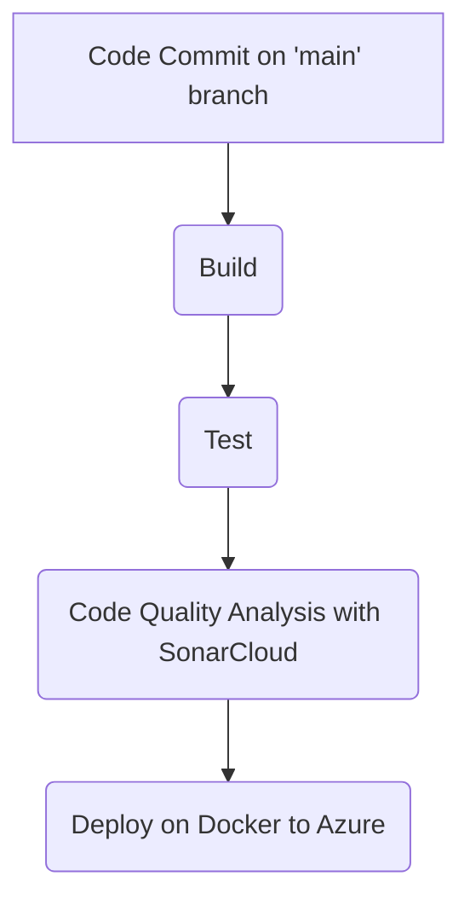

<br />
<div align="center">
  <a>
    
  </a>

  <h3 align="center">SSC0961 - Desenvolvimento Web e Mobile</h3>

  <p align="center">
    Este é um projeto para a matéria de Desenvolvimento Web e Mobile, o intuito desse aplicativo é ser um hub para o  gerenciamento de assinaturas recorrentes que você usuário possui, como Netflix, Spotify, Prime Video e etc... Espero que goste! 😊
  </p>
</div>
<br /><br />

# Expo APP + Node JS + MongoDB

This is an project that uses [Expo](https://expo.dev) to de client mobile app, [NodeJS]() for the APIs that comunicate with de client and [MongoDB]() for the database comunication. This is an exemple of the architecture of the Project:

<div align="center">
  
</div>

## Get started

1. Install dependencies in the client and API's components

   ```bash
   cd ./sub_control_client
   npm install
   cd ./sub_control_api
   npm install
   cd ./sub_control_api_signatures
   npm install
   ```

2. Start the client app

   ```bash
   cd ./sub_control_client
   npx expo start
   ```
   In the output, you'll find options to open the app in a

  - [development build](https://docs.expo.dev/develop/development-builds/introduction/)
  - [Android emulator](https://docs.expo.dev/workflow/android-studio-emulator/)
  - [iOS simulator](https://docs.expo.dev/workflow/ios-simulator/)
  - [Expo Go](https://expo.dev/go), a limited sandbox for trying out app development with Expo

3. Configure the .env file to the MongoDB string connection:

   ```
   MONGODB_URI=mongodb://[username:password@]host1[:port1][,...hostN[:portN]][/[defaultauthdb][?options]]
   ```

5. Start the API's components

   ```bash
   cd ./sub_control_api
   npm start
   cd ./sub_control_api_signatures
   npm start
   ```

## Git Flow


## Pipeline CI/CD


